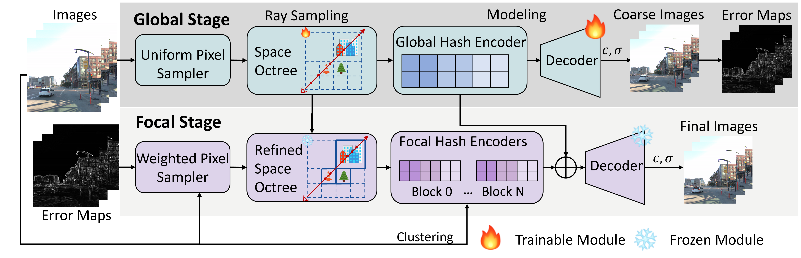

# GF-NeRF
Repository for paper "Global-guided Focal Neural Radiance Field for Large-scale Scene Rendering" (WACV 2025)

[Arxiv](https://arxiv.org/abs/2403.12839)|[Code](https://github.com/shaomq2187/GF-NeRF)[|Project Page](https://shaomq2187.github.io/GF-NeRF/)

## Abstract
Neural radiance fields~(NeRF) have recently been applied to render large-scale scenes. However, their limited model capacity typically results in blurred rendering results. Existing large-scale NeRFs primarily address this limitation by partitioning the scene into blocks, which are subsequently handled by separate sub-NeRFs. These sub-NeRFs, trained from scratch and processed independently, lead to inconsistencies in geometry and appearance across the scene. Consequently, the rendering quality fails to exhibit significant improvement despite the expansion of model capacity. In this work, we present global-guided focal neural radiance field (GF-NeRF) that achieves high-fidelity rendering of large-scale scenes. Our proposed GF-NeRF utilizes a two-stage (Global and Focal) architecture and a global-guided training strategy. The global stage obtains a continuous representation of the entire scene while the focal stage decomposes the scene into multiple blocks and further processes them with distinct sub-encoders. Leveraging this two-stage architecture, sub-encoders only need fine-tuning based on the global encoder, thus reducing training complexity in the focal stage while maintaining scene-wide consistency. Spatial information and error information from the global stage also benefit the sub-encoders to focus on crucial areas and effectively capture more details of large-scale scenes. Notably, our approach does not rely on any prior knowledge about the target scene, attributing GF-NeRF adaptable to various large-scale scene types, including street-view and aerial-view scenes. We demonstrate that our method achieves high-fidelity, natural rendering results on various types of large-scale datasets.




## Start
This work was developed on the basis of [Nerfstudio](https://github.com/nerfstudio-project/nerfstudio), and we have modified the internal code of Nerfstudio. Therefore, we recommend using this project in a separate environment from Nerfstudio.

Compiling F2NERF bindings requires appropriate CUDA version support, and we recommend using CUDA 11.8


### Installation
1、Install basic enviroment
```
conda create -n GF-NERF python=3.8
conda activate GF-NERF
pip install -e .
pip install git+https://github.com/NVlabs/tiny-cuda-nn/#subdirectory=bindings/torch
```
2、Compile F2-NERF bindings
```
cd gfnerf/bindings
python setup.py build develop
```

## Train
1、Prepare dataset in [Nerfstudio](https://github.com/nerfstudio-project/nerfstudio) format

2、Modify hyper-parameters in `./gfnerf/config.py`


3、Run the following command to train 

```
python scripts/train.py gf-nerf --data /path/to/your/data
```

## Test 
Follow the render commands in [Nerfstudio](https://github.com/nerfstudio-project/nerfstudio) to view/render trained scenes
<!-- ## Render
Download ckpts to `./renders/*` directory, and run the following command.
 ```
python scripts/render.py --camera-path-filename /mnt/nas-data/shaomingqi.smq/dataset/aerials/colmap/rubble/base_cam_render_test.json --load-config /mnt/nas-data/shaomingqi.smq/projects/GF-NeRF/ckpts/rubble/2024-02-29_132151/config.yml --output-format images --output-path renders/rubble/f2-nerf/val_error_sampler_100k+15*30k_log23_rays8192_train_0_3_nearest_embedding --traj filename --rendered_output_names rgb
 ``` -->


## Citation
If you find our work useful in your research, please consider citing:
```
@article{shao2024global,
title={Global-guided Focal Neural Radiance Field for Large-scale Scene Rendering},
author={Shao, Mingqi and Xiong, Feng and Zhang, Hang and Yang, Shuang and Xu, Mu and Bian, Wei and Wang, Xueqian},
journal={arXiv preprint arXiv:2403.12839},
year={2024}
}
```

## Acknowledgement
In this work we use parts of the implementations of the following work:

- [Nerfstudio](https://github.com/nerfstudio-project/nerfstudio)
- [F2-NeRF: Fast Neural Radiance Field Training with Free Camera Trajectories](https://github.com/totoro97/f2-nerf)

We thank the authors for open sourcing their method.


